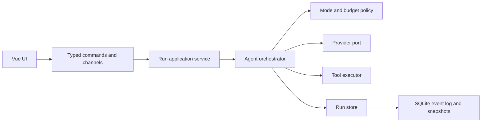
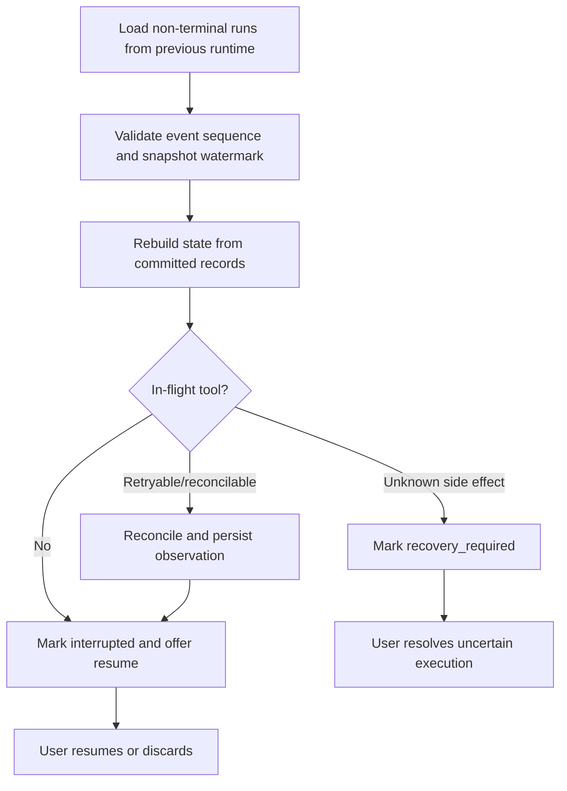

# Agent Runtime 模式编排与会话韧性设计

> 状态：后续设计约束  
> 版本：v1  
> 日期：2026-08-19  
> 适用阶段：P1-P4，P5 同步需复用其中的事件与幂等约束

## 1. 文档目的

本文把 ReAct、Plan-and-Execute、Reflection 三种思维模式映射到 Carrot 当前架构，并统一设计进程崩溃恢复、运行中追加消息、暂停与继续。

这不是三套彼此独立的 Agent Runtime。Carrot 只实现一套可持久化、可中断的 Run 引擎，三种模式是引擎之上的编排策略：

- ReAct 决定单个步骤如何根据工具反馈继续；
- Plan-and-Execute 决定复杂目标如何拆成有状态的 PlanStep；
- Reflection 决定何时对候选结果做有上限的质量检查与修订。

本文是后续领域模型、数据库 migration、Agent 状态机、IPC 和前端交互的设计输入。P1 已完成可恢复 Schema 基础，`agent` 与 `tools` 仍主要是模块边界；本文不表示 P2-P4 Runtime 行为已经实现。

## 2. 当前项目适配结论

现有架构可以承载混合模式，不需要改变 `commands -> application -> domain <- infrastructure` 的依赖方向：



需要在既有设计上补充四个边界：

1. `AgentOrchestrator`：唯一推进 Run 状态的写入者；
2. `ModePolicy`：选择直接回答、ReAct、Plan-and-Execute，以及是否执行 Reflection；
3. `RunStore`：保存 Run、PlanStep、事件、待处理输入、工具执行和快照，不能塞入现有仅负责会话 CRUD 的 `ConversationStore`；
4. `ToolRecoveryPolicy`：声明工具是否可取消、可重试、可查询结果以及采用何种幂等键。

Provider DTO、Diesel row 和 Tauri DTO 仍不得进入领域层。所有模式共享相同的规范化 Item、事件和工具执行记录。

## 3. 三种模式在 Carrot 中的使用

### 3.1 ReAct：步骤级探索器

使用条件：答案依赖外部信息、工具 Observation 会改变下一步动作，或当前路径无法预先完整规划。

Carrot 中的循环是：

```text
model request -> normalized output items -> tool decision -> durable intent
-> approval/policy -> tool execution -> durable observation -> next model request
```

约束：

- 默认最多 8 次模型调用，但由统一 RunBudget 控制，不在循环内部另设无限重试；
- 每次工具调用必须有稳定的 `call_id` 和本地 `tool_execution_id`；
- Observation 持久化成功后才能进入下一次模型调用；
- 不保存或展示模型的原始思维链。恢复所需内容是用户消息、模型可见 output items、工具输入输出、状态事件和必要的简短决策摘要；
- 相同 Observation 未改变上下文时不得无界重复相同工具调用。

### 3.2 Plan-and-Execute：Run 级组织器

使用条件：目标包含多个可辨识交付物、存在顺序或依赖关系，且完成标准可以在执行前描述。

Plan 不是一段只存在于 Prompt 中的文本，而是持久化的结构：

```text
Plan { id, run_id, revision, goal, status }
PlanStep { id, ordinal, title, acceptance, status, attempt, output_item_ids }
```

每个 PlanStep 内部可以使用 ReAct。执行中发现假设错误时生成新 Plan revision，并记录替换关系；不能静默改写旧计划。恢复时根据每个步骤的状态选择第一个未完成步骤，不能简单使用 `current_step_index + 1`，因为崩溃可能发生在步骤结果落盘之前。

### 3.3 Reflection：有预算的质量门

使用条件：代码、长报告、不可逆操作前的参数、或用户明确选择高质量模式。普通闲聊和低风险事实回答默认不执行。

Reflection 应审查可验证产物，而不是让模型无条件“再想一次”：

1. 根据任务验收标准生成结构化 critique；
2. 优先运行编译、测试、Schema 校验或引用检查等确定性验证；
3. 只有发现实质问题时才生成修订；
4. 保存 critique 摘要、验证结果和修订关联；
5. MVP 默认最多 1 轮，高质量策略最多 2 轮，并同时受 token、费用和截止时间限制。

Reflection 失败不应抹掉候选答案。引擎根据策略返回候选结果并标注未通过质量门，或将 Run 置为 `failed`。

### 3.4 默认组合策略

Carrot 建议提供 `auto`、`fast`、`quality` 三个产品策略，而不是要求普通用户理解三个内部术语：

| 产品策略  | 编排行为                                                                           |
| --------- | ---------------------------------------------------------------------------------- |
| `fast`    | 简单任务直接回答；需要工具时使用短 ReAct；不做 Reflection                          |
| `auto`    | 按复杂度选择直接回答或 Plan；步骤内按需 ReAct；高风险/高价值产物做 1 轮 Reflection |
| `quality` | 倾向显式 Plan；步骤内 ReAct；在预算允许时做 1-2 轮 Reflection                      |

模式路由首先使用可解释规则，后续才考虑单独的分类模型。路由结果必须记录 `strategy_selected` 事件及理由码，例如 `external_data_required`、`multi_deliverable`、`high_risk_output`，但不记录隐藏思维过程。

## 4. 统一运行模型

### 4.1 状态与阶段分离

`RunStatus` 表达生命周期：

```text
queued | running | pause_requested | paused | suspended
| waiting_for_approval | completed | failed | cancelled
| interrupted | recovery_required
```

`RunPhase` 表达当前工作位置：

```text
routing | planning | model_stream | tool_prepare | tool_execute
| observation_commit | reflecting | finalizing | none
```

将二者分离后可以准确表达“已请求暂停但一个外部副作用工具仍在执行”，而不是过早把 Run 标为 `paused`。

### 4.2 事件、规范化记录与快照

数据库真相由规范化业务记录和 append-only `run_events` 共同组成；`run_snapshots` 只用于快速加载，可以从前两者重建。

建议新增或扩展：

| 表                     | 关键用途                                                 |
| ---------------------- | -------------------------------------------------------- |
| `runs`                 | 生命周期、策略、phase、预算、父 Run、lease owner、版本号 |
| `run_events`           | 单调 `seq` 的状态转换与审计事件                          |
| `run_snapshots`        | 最近可恢复状态、事件高水位、上下文摘要                   |
| `plans` / `plan_steps` | 可修订计划和步骤状态                                     |
| `items`                | 用户、模型、function call/output 等有序上下文            |
| `tool_executions`      | 执行意图、参数 hash、幂等键、结果和恢复分类              |
| `pending_inputs`       | 执行期间收到且已确认落盘的用户输入                       |
| `run_leases`           | Runtime 实例所有权与心跳，可合并进 `runs`                |

所有状态推进使用乐观版本或事务锁，事务中同时写业务记录、`run_events` 和新版本号。前端 Channel event 的 `seq` 来自已提交事件；提交失败不能先向 UI 宣布成功。

### 4.3 检查点策略

“每个 ReAct 周期 Observation 后异步落盘”只适合非关键 UI 快照，不足以保护副作用。Carrot 使用分级持久化：

- 用户输入、模式选择、Plan revision：继续执行前等待提交；
- 工具执行意图：调用工具前等待提交；
- 工具 Observation：下一轮模型请求前等待提交；
- pause/completed/failed 等终态：对用户确认前等待提交；
- token 流片段、心跳和派生快照：允许合并、节流或异步写入。

SQLite 开启 WAL 仍不等于跨数据库与外部系统的原子事务。系统只能通过幂等、结果查询和人工确认缩小“不确定结果”窗口，不能承诺任意工具 exactly-once。

## 5. 工具副作用与恢复协议

### 5.1 Write-ahead 执行记录

每次工具调用按以下顺序：

```text
1. validate arguments and approval
2. commit tool_execution(status=prepared, arguments_hash, idempotency_key)
3. commit status=executing immediately before dispatch
4. execute or dispatch tool
5. commit succeeded/failed and normalized observation in one DB transaction
6. continue the Agent loop
```

崩溃可能发生在第 4、5 步之间，因此重启后看到 `executing` 只能说明“结果未知”，不能直接当作已成功，也不能统一跳过。

### 5.2 按工具能力恢复

| 工具类型             | 崩溃后处理                                                                     |
| -------------------- | ------------------------------------------------------------------------------ |
| 只读且结果可重复     | 使用同一逻辑调用 ID 重试，并记录 `recovered_by_retry`                          |
| 支持外部幂等键       | 用原幂等键查询或重试，关联原执行记录                                           |
| 支持结果查询         | 先 reconcile 外部状态，再决定完成或重试                                        |
| 本地文件写入         | 临时文件写入、flush/fsync、原子 rename；用目标 hash 验证                       |
| 不可查询的外部副作用 | 置为 `recovery_required`，展示参数和已知痕迹，由用户决定“标记完成”或“重新执行” |

邮件发送等工具必须把本地 `tool_execution_id` 映射为 Provider 支持的 idempotency key；若外部系统不支持幂等或查询，不能自动重放。

## 6. 场景一：进程崩溃后恢复

### 6.1 崩溃识别

仅用 `status = running AND last_checkpoint < now - 30s` 会把正常的长调用误判为崩溃。采用 Runtime lease：

- 每次应用启动生成 `runtime_instance_id`；
- active Run 记录 owner、lease expiry 和 heartbeat；
- 同一实例运行时只有 lease 过期才判定 worker 失联；
- 新实例启动时，所有属于旧实例的非终态 Run 直接进入恢复扫描，无需机械等待 30 秒；
- 单实例锁用于避免两个桌面进程同时接管同一 Run。

### 6.2 启动恢复流程



恢复上下文从最后一个已提交事件高水位构造。部分流式模型文本标记为 `abandoned` 或 `superseded`，默认不作为模型输入；已完整提交的 Observation 可以进入下一轮。系统不得仅凭“最后一条看起来像 Observation”猜测恢复点。

`std::panic::set_hook` 只能写最小崩溃标记或诊断日志。它是进程级 hook，不适合在 panic 路径中启动异步数据库保存，也覆盖不了 kill、断电和进程 abort，因此不能成为正确性机制。

### 6.3 恢复 UI

启动后在会话列表展示“可恢复”“需确认副作用”两种入口，内容至少包括：

- 最后一个已完成步骤；
- 当前 Plan 进度；
- 未决工具名称、参数摘要、风险级别；
- “继续”“结束任务”，以及不确定副作用场景下的“标记已完成”“重新执行”。

## 7. 场景二：运行中追加消息

### 7.1 输入必须先持久化

执行期间输入框保持可用。后端只有在 `pending_inputs` 提交成功后才向前端确认“已排队”，防止 UI 显示成功但崩溃后消息丢失。

每条输入携带明确意图：

```text
append            补充当前目标，在下一个安全点融合并重新评估计划
fork              挂起当前 Run，创建 parent_run_id 指向它的新 Run
cancel_and_replace 请求取消当前 Run，并以新输入创建后继 Run
```

前端默认记住用户最近选择；不应每条消息都弹模态框。输入区用轻量菜单显示“补充当前任务 / 开启分支 / 取消并改做”，高风险工具执行期间明确提示当前操作可能无法立即停止。

### 7.2 Thinking / model_stream 阶段

- Provider Adapter 必须接收 Run 级 `CancellationToken`；
- 收到新输入后请求取消当前流，将已有部分输出持久化为 `superseded` 供审计，但不加入后续上下文；
- 只有 Provider 请求不具备 cancellation safety 时，才允许等待其返回后丢弃结果；即便丢弃也记录 token/费用；
- 合并新输入后重新路由或 replan，不把它伪装成 system message。用户消息始终保留用户角色和稳定 ID。

使用 `tokio::select!` 前必须逐个验证参与 Future 的 cancellation safety。取消一个 Future 是 drop，而不等价于远端请求或阻塞任务已经停止。

### 7.3 tool_execute 阶段

工具声明 `CancellationSemantics`：

```text
immediate | cooperative | finish_current | not_cancellable
```

- 只读 async 工具可在确认 cancellation-safe 时停止；
- `spawn_blocking` 的 JoinHandle 被取消不代表底层同步操作停止；
- 本地写或外部副作用默认完成当前原子动作，再处理 pending input；
- 工具完成后先提交 Observation，再融合新消息，保证审计轨迹连续；
- 不确定副作用进入 `recovery_required`，新任务不能掩盖它。

### 7.4 上下文融合

`append` 触发一次目标变更事件。若当前为 Plan 模式，旧 Plan revision 标记 `superseded` 并生成新 revision；已完成步骤保留。若为 ReAct，下一轮上下文加入真实用户消息和一条引擎生成的任务状态摘要。

`fork` 创建新 Run，引用父 Run 的已提交上下文高水位。父 Run 状态为 `suspended`，但不会复制或改写历史 Item。

## 8. 场景三：暂停与继续

### 8.1 暂停不是瞬时状态

用户点击暂停后先进入 `pause_requested`：

- model_stream：取消安全时停止并舍弃部分候选输出；
- planning/reflecting：在当前模型调用边界暂停；
- tool_execute：按工具取消语义处理，副作用工具通常等待当前原子动作完成；
- 到达安全点后，同一事务写入事件、业务状态和快照，再进入 `paused`。

只有后端提交 `paused` 后，前端才显示“已暂停”。此前显示“正在暂停”。

### 8.2 恢复算法

1. 获取 Run lease 并检查乐观版本，防止重复恢复；
2. 校验快照事件高水位，必要时从规范化记录和事件重建；
3. 处理所有 `executing` 工具的 reconcile；
4. Plan 模式选择第一个 `pending`/可重试 `failed` 步骤，而非索引加一；
5. ReAct 模式从最后一个已提交 Observation 或用户输入继续；
6. 使用结构化 ResumeContext 告知模型当前目标、已完成事项、未完成事项和禁止重复的执行 ID；
7. 重新检查预算、Provider 配置、工具权限和审批是否仍有效；
8. 提交 `resumed` 事件后进入 `running`。

上下文过长时使用已持久化摘要加最近完整 Item 的窗口，不无条件回灌全部 trajectory。摘要保存来源 Item 高水位并可重新生成，不能替代审计原文。

### 8.3 自动暂停策略

“用户 5 分钟无交互”不适合作为 active Run 的暂停条件，长时间模型请求或工具执行本来就可能没有用户交互。应区分：

- Run deadline：限制一次 Run 的总时长；
- phase timeout：限制模型、审批和工具阶段；
- app lifecycle：退出、系统休眠和窗口后台事件触发检查点或暂停请求；
- UI idle：只影响界面资源，不改变 active Run 正确性。

首版直接使用 Tokio timer、Tauri 生命周期事件和 OS 唤醒处理即可。当前 Tauri 2 官方插件目录没有通用 `tauri-plugin-schedule`，不应把它写成既定依赖。

## 9. 并发、队列与所有权不变量

1. 同一 Conversation 默认最多一个 `running` Run，但允许多个 `paused`、`suspended` 或终态 Run；
2. 每个 Run 同时只能有一个有效 lease owner；
3. `run_events.seq` 在 Run 内严格递增，IPC 发现缺口后拉取快照；
4. 用户输入落盘后才 ACK；工具意图落盘后才执行；Observation 落盘后才继续；
5. PlanStep、tool execution 和 Item 使用 ULID/UUIDv7 等稳定 ID；排序依赖显式 `seq`/`ordinal`，不依赖 ID 的时间顺序；
6. 审批绑定 `run_id + call_id + arguments_hash`，恢复或 replan 后参数变化必须重新审批；
7. RunBudget 统一限制模型调用、工具次数、反思轮次、token、费用和 wall-clock deadline；
8. 任何 `recovery_required` 工具未解决前，不得把所属 Run 自动标为 completed。

## 10. IPC 与前端事件

在既有命令规划上增加：

```text
chat_pause(run_id, expected_version)
chat_resume(run_id, expected_version)
chat_submit_input(run_id, content, intent)
chat_recovery_list()
chat_recovery_resolve(run_id, tool_execution_id, resolution)
chat_snapshot_get(run_id, after_seq?)
```

Channel event 至少包含：

```text
run_id, seq, persisted_at_ms, kind, payload
```

前端 reducer 只应用连续 seq；重复事件去重，缺口通过 snapshot 修复。流式 token 可以使用独立 transient sequence，以免每个 token 都成为数据库事务；最终 Item 提交事件仍使用 durable seq。

## 11. 分阶段落地

### P1：先固定可恢复的数据基础

- migrations 中加入 `runs`、`items`、`run_events`、`pending_inputs` 基础字段、稳定 ID、外键与状态/序列约束；
- Conversation 只保存新 Run 的默认 Provider/Model；每个 Run 保存不可变的执行配置快照，不把执行状态塞进 Conversation；
- P1 只实现恢复查询和数据库不变量，不提前暴露 P3/P4 的 Orchestrator、追加输入或暂停 IPC；
- Repository 初始化启用 WAL、foreign keys、busy timeout；
- 测试事务回滚、事件 seq 唯一性和进程实例接管所需查询。

### P2：Provider 流与取消契约

- 引入 `tokio-util` 的 `CancellationToken`，建立 Run、Provider request 和 tool execution 的分层取消树；
- Provider port 支持结构化 output item、request ID、usage、stream completion 和 cancellation；
- 部分流式输出与 committed Item 分离；
- 验证 `previous_response_id` 失效时可用本地 Item 重建请求；
- 不依赖 Provider 远端存储完成本地恢复。

### P3：统一 Orchestrator 与混合模式

- 实现 RunStore、事件提交、lease、RunBudget 和 ModePolicy；
- 先实现 ReAct，再加入持久化 Plan revision；
- Reflection 作为有界后处理阶段接入；
- 工具注册时强制声明风险、幂等、reconcile 和取消能力。

### P4：韧性与产品交互

- 实现 pause requested、安全点、resume 和 durable pending input；
- 实现旧 runtime 扫描、工具结果 reconcile 和 recovery UI；
- 加入 app lifecycle、休眠/唤醒、崩溃和强制终止测试；
- 完成高风险审批、幂等键和文件原子写协议。

当前已完成首个交互切片：运行中的请求可区分 pause 与 cancel，在安全取消点提交 `paused` 或 `cancelled`；两者都会恢复原始输入和附件，用户编辑后创建新 Run，并在同一事务中 supersede 旧 Run 的消息。该行为满足“暂停后编辑重发”，但不等同于恢复旧 Run 的执行位置；同 Run resume、durable pending input、lease takeover 和副作用 reconcile 仍属于后续 P4。

P5 同步不得同步 active lease；只同步已提交 Item、事件和稳定业务记录。冲突解决不能重放工具副作用。

## 12. 验证矩阵

| 场景                       | 必须验证的结果                                     |
| -------------------------- | -------------------------------------------------- |
| Observation 提交前 kill    | 工具按能力重试/reconcile/等待人工，绝不盲跳过      |
| Observation 提交后 kill    | 恢复后从下一次 model request 继续，不重复工具      |
| 流式模型中追加             | 部分输出 superseded，新用户消息不丢失且触发 replan |
| 文件写到一半 kill          | 原目标文件保持旧版本或完整新版本，无半文件         |
| 外部副作用结果未知         | Run 为 recovery_required，UI 要求用户决策          |
| pause 与工具完成竞态       | 只有一种有序事件结果，Observation 不丢失           |
| 重复 resume/click          | lease/version 阻止双 worker                        |
| IPC event 丢失/重复        | reducer 去重并通过 snapshot 修复缺口               |
| Plan replan 后恢复         | 已完成步骤不重做，从新 revision 的未完成步骤继续   |
| Reflection 超预算          | 有界停止并保留候选答案或明确失败原因               |
| Provider remote state 丢失 | 使用本地规范化 Item 重建上下文                     |
| 系统休眠再唤醒             | lease、deadline 和 timeout 重新计算且不误重放工具  |

测试采用 Fake Provider、Fake Tool、故障注入点和临时 SQLite。关键状态转换应支持在事务提交前后定点终止进程，而不仅是普通单元测试。

## 13. 设计决策摘要

- 三种模式是同一 Runtime 的分层策略，默认使用可预算的混合编排；
- 检查点不能替代工具 write-ahead 记录，关键边界必须等待持久化；
- 任意外部副作用无法由本地 SQLite 保证 exactly-once；恢复按幂等与可查询能力分类；
- 原始思维链不持久化，保存可重放上下文与可审计事件；
- 新输入先进入 durable inbox，再在安全点 append、fork 或 cancel-and-replace；
- 暂停是请求到安全点的协议，不是立即切换布尔值；
- 恢复依据事件高水位和步骤状态，不依据最后一条 UI 消息或 `index + 1`；
- panic hook 和 UI idle timer 都不是恢复正确性的主线机制。

## 14. 参考

- [Tokio `select!` cancellation safety](https://docs.rs/tokio/latest/tokio/macro.select.html#cancellation-safety)
- [Rust `std::panic::set_hook`](https://doc.rust-lang.org/std/panic/fn.set_hook.html)
- [Tauri 2 Features and Plugins](https://v2.tauri.app/plugin/)
- [Carrot LLM 客户端设计与实施规划](llm-client-design-plan.md)
- [ADR 0002：异步持久化与 Provider SDK 边界](adr/0002-async-persistence-and-provider-sdk.md)
- [ADR 0003：持久化 Run Runtime 不变量](adr/0003-durable-run-runtime.md)
