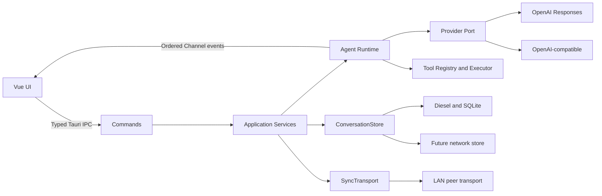

# Carrot LLM 客户端设计与实施规划

> 版本：v10
>
> 更新日期：2026-08-19
>
> 当前阶段：P3 已完成，P4 会话交互与推理摘要切片已完成

## 1. 产品目标与确认边界

Carrot 是基于 Tauri、Rust、Diesel、Vue 和 TypeScript 的桌面 LLM 客户端。它通过 OpenAI API 或 OpenAI-compatible API 工作，不自动登录或控制 ChatGPT 网页。

已确认：

- 首发平台为 macOS，架构保留 Windows/Linux 支持能力；
- OpenAI Responses API 是首个原生 Provider，首版发送 `store: true`；
- 必须支持通过本地配置文件加载自定义 OpenAI-compatible Base URL；
- 本地保存完整会话与 Agent 执行记录，并通过存储端口为网络存储预留实现；
- 支持文件附件和图片输入；
- 跨设备同步首选局域网扫描、设备配对和点对点同步；
- 暂不要求会话导出和应用层数据库加密；API Key 仍必须进入 OS 安全凭证存储，局域网同步必须加密传输。

## 2. MVP 能力

1. OpenAI Responses 和可配置 OpenAI-compatible Provider；
2. 文本、文件附件和图片输入，Markdown 流式输出；
3. SQLite 本地会话、执行轨迹和附件元数据；
4. 工具注册、严格 JSON Schema、超时、审批和结构化错误；
5. 工具调用循环、最大步数、取消、串行与安全并行；
6. 工具调用详情、token、耗时和错误审计；
7. macOS 应用打包；
8. 局域网设备发现、配对和会话同步的初始版本。

MVP 不包含任意 shell/代码执行、多 Agent、RAG、云账户同步和完整 MCP。

## 3. 从 AI Agent 设计提炼的约束

《AI Agents in Depth》的核心调用循环是：声明工具、模型选择工具、执行工具、将结果写回上下文、模型继续决策。工程实现必须满足：

- 用户输入、模型 output items、工具调用和工具结果构成可重放的完整轨迹；
- `call_id` 是调用与结果的唯一关联键；
- 同轮独立且只读的工具可以并行，有数据依赖的工具跨轮串行；
- 最终文本、最大步数、取消、不可恢复错误和等待授权都是明确状态；
- 工具描述应说明触发条件、边界、参数例子、返回结构与代价；
- 参数不得静默转换；必要转换同时记录原值与最终值；
- 文件、网络、写操作和代码执行必须实施最小权限与人工确认；
- 工具过多时采用场景子集、分组或按需发现，不在每轮平铺全部 Schema。

ReAct、Plan-and-Execute 与 Reflection 不实现为三套 Runtime，而是统一 Run 引擎上的分层策略：复杂目标先形成可持久化 Plan，PlanStep 内按需使用 ReAct，代码、报告和高风险结果再经过有预算上限的 Reflection。普通产品界面优先暴露 `fast`、`auto`、`quality` 策略，内部路由决定具体组合。

恢复与中断遵守以下额外约束：关键用户输入、工具执行意图和 Observation 必须在继续前提交；原始思维链不持久化；副作用未知的工具不自动重放；暂停必须等待安全点；执行中追加的输入先进入持久化队列。完整设计见 [Agent Runtime 模式编排与会话韧性设计](agent-runtime-modes-and-resilience.md)。

OpenAI Responses API 适配器需要保留 `function_call`、`function_call_output`、`call_id`、完整 output items 和 `previous_response_id`。Function Schema 默认 `strict: true`。

## 4. 总体架构



依赖方向为：

```text
commands -> application -> domain <- infrastructure
```

Rust 持有 Provider 请求、密钥、工具权限、存储和同步；Vue 只持有视图状态。平台专用代码只能存在于基础设施 Adapter。

Rust 统一使用 Tokio 运行时，跨层异步端口使用 `async_trait`。阻塞型基础设施必须在 Adapter 内隔离，不能占用 Tokio worker；应用服务只依赖异步端口。

## 5. Rust 模块

```text
src-tauri/src/
├── commands/       # 窄而类型安全的 Tauri API
├── application/    # 用例与事务边界
├── domain/         # Provider、附件、存储、同步领域类型/端口
├── agent/          # 上下文构造和工具循环
├── providers/      # OpenAI 与 compatible adapters
├── tools/          # registry、policy、executor
├── persistence/    # Diesel repositories 和 migrations
├── credentials/    # OS credential adapters
├── sync/           # LAN discovery/transport adapters
└── error.rs        # 稳定应用错误契约
```

Provider 领域请求包含模型、instructions、规范化 input items、附件引用、工具、`tool_choice`、并行策略和 `previous_response_id`。Adapter 负责 HTTP/SSE 与厂商数据归一化，不把厂商 SDK 类型泄露到领域层。IPC DTO、domain model、persistence model 和 provider SDK model 必须通过显式 `From`/`TryFrom` 转换，不允许跨层复用数据库 row 或厂商 DTO。

## 6. Provider 配置

采用 TOML 文件，默认从 Tauri 应用配置目录加载。开发仓库中的 `config/providers.example.toml` 只作为样例。

每个 Profile 至少包含：

- `id`、`label`、`kind`；
- `base_url`、`default_model`；
- `credential_ref`；
- `store_responses`，首版默认和 OpenAI Profile 均为 `true`；
- 后续增加 capability overrides、额外 headers 和超时。

配置加载必须验证 HTTPS 策略、URL、重复 ID 和未知字段。Loopback HTTP 可用于本地兼容服务；远程明文 HTTP 默认拒绝。兼容 Provider 必须通过能力协商或显式配置区分 Responses 与 Chat Completions，不假设所有 `/v1` 服务都支持相同协议。

P2 补充将配置升级为版本化 Provider Catalog，持久化默认 Provider、远端模型目录、启用模型和默认模型。模型目录通过 OpenAI-compatible `GET /models` 同步，但不根据名称推断对话能力。所有修改经 Rust 校验后原子写回本地文件，应用启动重新加载。完整结论见 [Phase 2 Provider 管理补充报告](phase-2-provider-management.md)。P3 已让 Responses 与 Chat Completions Profile 都进入统一 Runtime，详见 [P3 Durable Agent Runtime 阶段报告](phase-3-durable-agent-runtime.md)。

API Key 不允许写入配置文件，配置只保存 OS credential reference。

## 7. Agent Runtime 与工具循环

Run 生命周期与执行阶段分离。生命周期状态机：

```text
queued -> running -> pause_requested -> paused -> running -> completed
                 -> suspended | waiting_for_approval
                 -> failed | cancelled | interrupted | recovery_required
```

执行阶段单独记录为 `routing | planning | model_stream | tool_prepare | tool_execute | observation_commit | reflecting | finalizing | none`。`max_steps_exceeded` 作为停止原因，不与生命周期状态混用。

核心循环：

```text
构建上下文 -> 请求 Provider -> 持久化 output items
若无 function_call：完成
若有 function_call：解析 -> Schema 校验 -> 权限判断 -> 执行
-> 持久化 function_call_output -> 回到请求 Provider
```

默认最大 8 次模型调用；Plan、ReAct 和 Reflection 共享统一 RunBudget，另限制工具次数、反思轮次、token、费用和截止时间。同一会话默认只有一个 active Run。P2 引入 `tokio-util::sync::CancellationToken` 形成分层取消树，但每个 Provider Future 和工具仍必须单独声明 cancellation safety。进程崩溃后由 runtime lease 扫描旧实例的非终态 Run；副作用未知的工具进入 `recovery_required`，不自动重放。

工具执行管线：

```text
lookup -> parse -> schema validate -> policy -> approval
       -> timeout/cancel -> execute -> redact/truncate -> persist -> return
```

风险分级：`read_only`、`local_write`、`external_side_effect`、`dangerous`。MVP 自动执行低风险工具，写操作逐次授权，危险工具默认关闭。

## 8. 附件与图片输入

附件处理分为四步：

1. Tauri 文件选择器只返回用户明确选择的文件；
2. Rust 校验 MIME、大小和实际文件头，将附件复制到应用数据目录；
3. SQLite 只保存元数据、hash、相对存储路径和生命周期状态；
4. Provider Adapter 按能力选择 base64 data URL、远端 file ID 或 compatible 格式。

首版至少支持 PNG、JPEG、WebP 和非动图 GIF。大小上限、压缩策略、EXIF 清理与缩略图在 P2 开始前固定。模型不支持图片时，Provider 必须返回明确 capability error，不能静默忽略附件。

## 9. Diesel 与本地存储

SQLite 位于 Tauri `app_data_dir`。P1 采用 Diesel 2.3、`diesel-async` 0.9 的 SQLite `SyncConnectionWrapper` 和 Tokio blocking pool。该方案提供异步 Repository 接口，但不把 SQLite 描述为原生异步引擎。启动时执行嵌入式 Diesel migrations，启用 foreign keys、WAL 和 busy timeout。

数据库变化只允许通过版本化 migration 实现，禁止在运行时代码中临时 `CREATE/ALTER TABLE`。每次迁移至少测试空库和上一支持版本升级；迁移失败时禁止开放写入。查询、插入和更新使用独立 persistence model，通过 `From`/`TryFrom` 与领域模型转换，转换失败返回稳定存储错误并保留可诊断日志。

核心表：

| 表                  | 用途                                      |
| ------------------- | ----------------------------------------- |
| `conversations`     | 会话标题、新 Run 的默认 Provider/模型     |
| `runs`              | 一次用户提交对应的 Agent 运行与停止原因   |
| `items`             | 有序的用户/模型/function call/output 轨迹 |
| `attachments`       | 文件元数据、hash、相对路径、MIME、大小    |
| `tool_executions`   | 参数、结果、状态、风险与耗时              |
| `tool_approvals`    | 与参数 hash 绑定的审批记录                |
| `provider_profiles` | 非敏感 Provider 配置快照                  |
| `usage_records`     | Provider usage 和成本估算                 |

P1 创建 `runs`、`items`、`run_events` 与 `pending_inputs` 的稳定数据基础和约束，但不提前暴露 Runtime 行为。P3/P4 通过后续 migration 加入 `run_snapshots`、`plans`、`plan_steps` 及完整工具恢复字段。规范化记录和 append-only 事件是恢复依据，快照仅用于加速加载。工具调用前的执行意图与调用后的 Observation 都属于必须等待提交的关键边界，不能只依赖异步周期快照。

本地数据库是恢复和审计真相源。即使使用 `store: true` 和 `previous_response_id`，也保存规范化 output items 和必要 raw JSON。Repository 由 `ConversationStore` 端口暴露，为后续网络存储 Adapter 保持边界。

### Provider SDK 选型

P2 已采用第三方 Rust SDK `openai-oxide` 0.16 作为 OpenAI Responses Adapter。P3 在关闭 default features 的前提下启用 `responses`、`chat` 和 `models`；自定义 Base URL、`store`、图片 data URL、严格 Function Schema、文本增量和 function-call 完成事件均转换为 Carrot 自有模型。Chat Completions compatible Adapter 已使用本地 `127.0.0.1:11434/v1` 完成流式实测；工具调用能力仍以具体服务是否返回结构化 `tool_calls` 为准。

`openai-oxide` 不作为原生 Gemini SDK。Gemini 的 OpenAI-compatible 网关只有在协议契约测试通过时才复用 compatible Adapter；未来直连 Gemini 原生 API 时实现独立 `GeminiProvider`，并在该阶段评估原生 SDK 或多 Provider SDK。无论采用何种 SDK，Agent Runtime 只看到 Carrot 自有的 Provider domain model。

## 10. Tauri IPC

Command 负责请求/响应，P2 通过带 `run_id` 的 Tauri Event 转发 Provider 流；P3 durable Runtime 为 committed Event 引入单调 sequence 和 `chat_snapshot` 恢复。token delta 保持 transient，不占用数据库事务序号；最终消息与工具轨迹通过 Snapshot 对账。前端不得获得通用 SQL、任意 HTTP 代理、任意工具执行、密钥读取或任意路径访问接口。

P1-P3 逐步加入：

```text
conversation_list/create/get/rename/delete
chat_start/cancel
chat_pause/resume
chat_submit_input
chat_recovery_list/resolve
attachment_import/remove
tool_approval_resolve
provider_profile_list/reload/test
sync_peer_scan/pair/start/stop
credential_set/delete
```

Rust DTO 是 IPC 真相源，通过 Tauri Specta 生成 `src/bindings.ts`。所有 durable 事件包含 `run_id` 与单调递增 `seq`；transient 流事件只负责即时显示。前端在加载和终态后获取后端快照，不猜测丢失内容。

## 11. Vue 前端

```text
src/
├── api/          # generated bindings 的薄封装
├── components/   # chat、tools、attachments、sync、settings
├── composables/  # run 与 conversation 生命周期
├── stores/       # 视图快照，不作为持久化真相源
├── views/
└── bindings.ts   # Rust 生成
```

主要界面包括会话列表、消息轨迹、附件预览、输入区、工具调用详情、审批弹窗、Provider 设置和局域网设备页。Markdown 禁止原始 HTML，外链经过协议白名单。

## 12. 局域网同步设计

局域网同步不是“扫描到即同步”。至少包含：

- 受限频率的本地网络发现；
- 用户确认的设备配对和可验证身份；
- TLS 或等价的端到端加密通道；
- 会话/Item 稳定 ID、版本向量或等价冲突信息；
- 增量同步、附件分块、hash 校验与断点恢复；
- 删除 tombstone 和明确的数据保留策略；
- 可撤销设备信任及完整同步审计。

领域层通过 `SyncTransport` 隔离发现和传输。macOS 的本地网络权限说明、Windows 防火墙和 Linux 网络差异留在平台 Adapter。

## 13. 安全要求

- API Key 进入 OS credential store，不进入 TOML、SQLite、日志、前端状态；
- 自定义 Base URL 明确提示其会接收用户内容和凭证；
- 附件和文件工具只能访问应用授权目录与复制后的内部文件；
- canonical path 检查阻止 `..` 和符号链接逃逸；
- 工具输出限制大小并标记截断；
- 审批绑定 `run_id + call_id + arguments_hash`；
- 副作用工具使用 idempotency key，未知结果不盲重试；
- 局域网设备必须配对、加密和可撤销；
- Tauri capabilities 按阶段以最小权限增加。

## 14. 测试与验收

Rust 单元测试覆盖 SSE 分片、Schema、call/output 关联、状态机、取消、超时、路径边界和上下文完整性。集成测试使用 Fake Provider + 临时 SQLite 验证完整工具循环、迁移、恢复与幂等。

恢复测试必须加入事务边界故障注入：工具 dispatch 前后、Observation commit 前后、pause 与工具完成竞态、重复 resume、外部副作用结果未知、系统休眠/唤醒。不能只测试正常退出后的反序列化。

前端测试覆盖 ChatEvent reducer、附件预览、审批、停止/重试、Markdown 安全与响应式布局。端到端必须验证普通对话、图片问答、多工具、非法参数、审批拒绝、取消、最大步数、重启恢复和密钥不落盘。

同步测试还需覆盖配对拒绝、中间人失败、冲突合并、断点续传、重复 Item 与设备撤销。

## 15. 实施阶段

| 阶段 | 内容                                                                      | 状态   |
| ---- | ------------------------------------------------------------------------- | ------ |
| P0   | 工程、分层、类型安全 IPC、质量门禁、ADR                                   | 已完成 |
| P1   | 异步 Diesel/SQLite、可恢复 Schema、模型转换、会话 CRUD、Provider 配置加载 | 已完成 |
| P2   | 设置中心、Keychain、`openai-oxide` Responses、SSE、取消树、附件/图片      | 已完成 |
| P3   | 工具 Registry/Executor、统一 Run 引擎、混合模式、事件与审计 UI            | 已完成 |
| P4   | 审批、安全、持久化输入队列、暂停/恢复、崩溃恢复、macOS 打包加固           | 进行中 |
| P5   | 局域网发现、配对、加密同步与冲突处理                                      | 待开始 |
| P6   | Windows/Linux 打包、MCP、网络存储和其他扩展                               | 待开始 |

每个阶段完成后更新独立阶段报告，记录交付物、验证命令、遗留风险和下一阶段计划。

P1 阶段结论见 [Phase 1 本地持久化与会话工作区报告](phase-1-local-persistence.md)。P2 阶段结论见 [Phase 2 Provider Runtime 报告](phase-2-provider-runtime.md)，P3 结论见 [P3 Durable Agent Runtime 阶段报告](phase-3-durable-agent-runtime.md)。P4 已完成的交互切片见 [P4 会话体验与运行控制切片](phase-4-chat-experience.md) 和 [P4 主题与推理摘要切片](phase-4-appearance-and-reasoning.md)。

## 16. P0 验收

- Tauri 2 + Vue 3 + TypeScript 工程可启动；
- Rust 分层骨架和统一错误存在；
- 健康检查通过生成的 TypeScript binding 调用；
- lint、format、typecheck、Vue tests、Rust clippy/tests 全部通过；
- macOS 前端和 Tauri bundle 构建通过；
- CI 检查 binding 漂移；
- ADR 和 Provider 配置样例完成。

阶段结论见 [Phase 0 工程基线报告](phase-0-baseline.md)。

异步持久化与 Provider SDK 决策见 [Phase 0 架构补充](phase-0-architecture-supplement.md) 和 [ADR 0002](adr/0002-async-persistence-and-provider-sdk.md)。

Agent 模式、检查点、副作用恢复、运行中追加消息及暂停/继续的约束见 [Agent Runtime 模式编排与会话韧性设计](agent-runtime-modes-and-resilience.md)。

持久化 Runtime 的已接受架构不变量见 [ADR 0003](adr/0003-durable-run-runtime.md)。

## 17. 资料来源

- [AI Agents in Depth：Agent 基础知识](https://bojieli.github.io/ai-agent-book/book/chapter1/)
- [AI Agents in Depth：上下文工程](https://bojieli.github.io/ai-agent-book/book/chapter2/)
- [AI Agents in Depth：工具](https://bojieli.github.io/ai-agent-book/book/chapter4/)
- [OpenAI Function Calling](https://developers.openai.com/api/docs/guides/function-calling)
- [OpenAI Conversation State](https://developers.openai.com/api/docs/guides/conversation-state)
- [OpenAI Images and Vision](https://developers.openai.com/api/docs/guides/images-vision)
- [Tauri：Calling Rust from the Frontend](https://v2.tauri.app/develop/calling-rust/)
- [Tauri：State Management](https://v2.tauri.app/develop/state-management/)
- [Diesel：Getting Started](https://diesel.rs/guides/getting-started.html)
- [diesel-async](https://docs.rs/diesel-async/0.9.2/diesel_async/)
- [openai-oxide](https://github.com/fortunto2/openai-oxide)
- [Vue：TypeScript with Composition API](https://vuejs.org/guide/typescript/composition-api)
