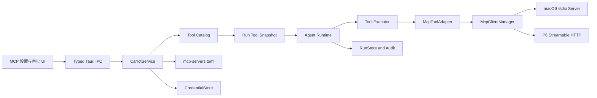

# Carrot MCP 支持方案与实施计划

> 版本：v2
>
> 更新日期：2026-08-20
>
> 适用阶段：P5-P6
>
> 当前状态：P5-P6 macOS MCP 已完成

## 1. 目标与结论

Carrot 在 P5-P6 将 MCP（Model Context Protocol）提升为最高优先级扩展能力。首轮只承诺 macOS，优先完成本地 stdio MCP Server、工具发现、受控执行、审批、审计和恢复，再扩展 Streamable HTTP、OAuth 与高风险工具。Windows/Linux 暂不进入交付验收，但领域模型、端口、配置格式和进程管理边界不得绑定 macOS 私有类型。

可行性结论为 `fits with adjustments`：现有 `AgentTool`、`ToolRegistry`、`AgentRuntime`、`ToolApproval`、`RunStore`、`CredentialStore` 和 `CancellationToken` 可以复用；实施前必须先补齐动态工具目录、Run 级不可变工具快照、JSON Schema 校验、MCP 工具身份持久化及结果未知恢复语义。

## 2. 范围

### 2.1 P5 交付范围

- macOS 本地 stdio MCP Client；
- 版本化 MCP Server 配置；
- Server 连接、初始化、能力协商、分页工具发现和关闭；
- MCP Tool 到 Carrot `AgentTool` 的适配；
- 显式 allowlist 的只读工具调用；
- 输入 JSON Schema 校验、结构化结果归一化和输出限制；
- MCP 工具来源、Schema、策略与执行轨迹的持久化；
- Server 和工具管理 UI；
- 审批、取消、超时、暂停/恢复和崩溃恢复与现有 Run Runtime 对齐。

### 2.2 P6 交付范围

- macOS 受控本地写入和脚本类 MCP Server；
- Server 进程权限约束、允许目录、最小环境和危险工具强制审批；
- Streamable HTTP Client；
- HTTPS、loopback HTTP、重定向和凭证发送边界；
- Bearer 与 MCP OAuth 授权；
- 工具列表变更、健康状态、有限重连和缓存失效；
- 生产级故障恢复、资源上限、诊断和 macOS 打包验收。

### 2.3 非目标

- P5 不支持远程 HTTP、OAuth、sampling、elicitation、prompts、resources、MCP Tasks 或多轮 `input_required`；
- P5 不开放通用 shell、任意代码执行或默认可写文件系统；
- P6 不承诺完整实现 MCP 的所有 Client/Server 能力；
- Carrot 不在本阶段实现 MCP Server；
- 不把 MCP Server 自报 annotations、工具名或描述当作可信权限声明；
- Windows/Linux 不进入 P5-P6 发布门禁；
- 局域网同步、网络存储和云端 MCP Registry 不属于本计划。

## 3. 设计原则

1. **MCP 是外部工具源，不是第二套 Agent Runtime。** Provider 仍只看到 Carrot 自有的 `ToolDefinition`，工具调用仍经过统一 Run 引擎。
2. **配置启用不等于模型可调用。** Server、Tool、风险策略和会话暴露范围分别控制。
3. **默认不信任。** 新发现工具默认不暴露；未分类工具默认 `external_side_effect`；危险工具默认关闭。
4. **Run 内工具集合稳定。** Run 开始时形成不可变工具快照，工具热更新只影响后续 Run。
5. **审批绑定实际执行身份。** 审批至少绑定 `run_id + call_id + arguments_hash + server_id + remote_tool_name + schema_hash + policy_version`。
6. **取消不等于未执行。** 非幂等调用在超时、断连或取消后无法确认结果时进入 `recovery_required`，不得自动重放。
7. **外部进程是权限边界。** 参数检查只是纵深防御；文件和脚本安全依赖 MCP Server 自身限制及其进程权限约束。
8. **macOS-first，不污染领域层。** Keychain、进程终止、目录授权和应用生命周期由平台 Adapter 实现。

## 4. 目标架构



建议模块布局：

```text
src-tauri/src/
├── domain/mcp.rs          # Server、Tool、Policy、状态和稳定身份
├── mcp/
│   ├── mod.rs
│   ├── config.rs          # 版本化 TOML 与原子写入
│   ├── manager.rs         # 生命周期、连接和工具发现
│   ├── adapter.rs         # MCP Tool -> AgentTool
│   ├── result.rs          # MCP 内容归一化和限制
│   └── platform/
│       ├── mod.rs         # 进程约束端口
│       └── macos.rs       # P6 macOS 实现
├── tools/
│   ├── mod.rs             # AgentTool 与执行入口
│   ├── catalog.rs         # 动态来源和不可变快照
│   ├── policy.rs          # 风险与暴露策略
│   └── schema.rs          # 输入/输出 Schema 校验
└── commands/mcp.rs        # 窄 MCP 管理 IPC
```

领域层不得引用 `rmcp`、Tauri、Keychain 或 macOS API。`rmcp` 类型只能存在于 MCP infrastructure Adapter，并通过显式转换进入 Carrot 自有模型。

## 5. SDK 与协议策略

采用官方 Rust SDK [`modelcontextprotocol/rust-sdk`](https://github.com/modelcontextprotocol/rust-sdk)。规划基线为 `rmcp 3.1.x`，最低 Rust 版本要求低于当前 Carrot toolchain。

P5 依赖建议：

```toml
rmcp = { version = "3.1", default-features = false, features = [
  "client",
  "transport-child-process",
] }
```

P6 按需增加：

```text
transport-streamable-http-client-reqwest
auth
```

不启用默认 `server`、`macros` 等无关特性。`Cargo.lock` 固定实际解析版本；升级 SDK 必须运行 MCP 契约测试、Runtime 恢复测试和 macOS smoke test。

协议策略：

- 首次实现优先使用 SDK 提供的兼容生命周期和版本协商；
- P5 只消费最终 `complete` Tool Result，遇到 `input_required` 返回明确的 unsupported capability 错误；
- 工具发现使用 `list_all_tools()`，不得只读取第一页；
- `tools/list_changed` 在 P6 接入，更新生成下一版本 Catalog，不改变 active Run；
- sampling、elicitation、roots、prompts、resources 和 Tasks 逐项评估，不因 SDK 支持而自动开放。

## 6. 配置与身份模型

使用独立的 `mcp-servers.toml`，不与 `providers.toml` 混合。配置文件必须版本化、拒绝未知字段、经过 Rust 校验并原子写回。

每个 Server 至少包含：

- 稳定 `id` 和用户可见 `label`；
- `enabled`；
- transport 配置；
- stdio 的可执行文件、参数、工作目录和受控环境引用；
- HTTP 的 URL 与 credential reference；
- Server 级启用策略和 Tool allowlist；
- 每个 Tool 的风险、审批、幂等、可取消、可 reconcile 策略；
- 可选允许目录和超时；
- 配置版本与策略版本。

禁止：

- 在 TOML 中保存 token、密码或完整敏感环境变量；
- 自动通过 shell 解释一整段 command；
- 使用 Server 自报名称作为全局唯一标识；
- 根据工具名自动降低风险；
- 在启动时自动安装 `npx`、`uvx` 包或执行来源不明的远程代码。

模型使用的工具名必须由 Carrot 生成稳定 provider alias。映射至少保存 `server_id + remote_tool_name + alias + schema_hash`，并处理长度、字符集和碰撞；不得直接依赖 `server::tool` 形式。

## 7. Tool Catalog 与 Run 快照

当前 `ToolRegistry` 是不可变 `Arc<HashMap>`，且 Service 在多个 Run 入口重新创建 built-in Registry。P5 必须先引入 Service 级 Tool Catalog：

```text
built-in tools + enabled MCP tool revisions
    -> validated catalog revision
    -> immutable Run ToolRegistry snapshot
    -> Provider definitions and Executor lookup
```

Catalog revision 至少包含：

- 工具来源与稳定身份；
- provider alias；
- description、input schema、可选 output schema；
- Schema dialect 与 hash；
- Tool annotations 原值，但标记为 untrusted；
- Carrot policy snapshot；
- Server config revision；
- 发现时间和可用状态。

Run 开始、分支或恢复时必须遵守：

- 新 Run 使用当前 Catalog 快照；
- 同一 Run 恢复使用持久化快照，不重新解释最新风险配置；
- 已审批工具缺失或 Schema 变化时暂停并进入人工恢复，不用同名新工具替代；
- Server 离线时保留审计身份，但不得向新 Run 暴露不可执行工具。

## 8. Schema 与结果处理

MCP `inputSchema` 默认使用 JSON Schema 2020-12，也可能显式声明其他允许 dialect。P5.0 必须先验证候选 Rust JSON Schema validator 对 2020-12、draft-07、本地 `$ref`、远程 `$ref` 禁止策略和资源上限的支持，再固定依赖。

输入处理顺序：

```text
alias lookup -> snapshot lookup -> JSON parse -> schema validate
-> policy evaluate -> approval -> durable intent -> MCP call
```

结果不得统一压成字符串。Carrot 自有结果模型至少保留：

- `structuredContent`；
- text content；
- image/audio 元数据与受限 payload；
- embedded resource 和 resource link 元数据；
- `isError`；
- MCP protocol error 与 tool execution error 的区别；
- 原始结果的有界诊断摘要。

在写入 SQLite 或送回模型前执行数量、单项大小、总大小、MIME 和文本截断限制。存在 `outputSchema` 时验证 `structuredContent`；失败作为不可信 Server 输出处理，不静默修正。

## 9. 风险、审批与隔离

### 9.1 风险策略

| 来源或策略                    | 默认行为                              |
| ----------------------------- | ------------------------------------- |
| 新 Server                     | 禁用                                  |
| 新发现 Tool                   | 不暴露给模型                          |
| 未分类 Tool                   | `external_side_effect`，逐次审批      |
| 显式可信只读 Tool             | `read_only`，可自动执行               |
| 本地写入 Tool                 | `local_write`，逐次审批               |
| 网络副作用 Tool               | `external_side_effect`，逐次审批      |
| shell、脚本、包管理、系统控制 | `dangerous`，默认关闭，启用后逐次审批 |

MCP annotations 和工具描述只能帮助 UI 展示或提醒用户，不能直接决定风险、幂等或审批豁免。

### 9.2 macOS 进程边界

P5 stdio Server 先采用显式配置的可执行文件和参数，清理继承环境，限制工作目录，并保证 stdout 只用于 MCP、stderr 被持续消费且经过脱敏。应用退出、Server 禁用和配置替换必须终止子进程及其进程树。

P6 在开放写入或脚本前完成 `ProcessIsolation` 平台端口和 macOS Adapter。验收关注实际权限结果，不把路径字符串规范化、命令关键字黑名单或审批弹窗描述为沙箱。若无法证明 Server 进程只能访问授权范围，则对应危险能力保持禁用。

### 9.3 取消与结果未知

- read-only 且可取消工具可以发送 MCP cancellation，并按普通取消收口；
- 非幂等工具在请求已经 dispatch 后取消、超时、连接中断或进程崩溃，默认结果未知；
- 结果未知必须提交 durable 事件并进入 `recovery_required`；
- 只有声明并验证 reconcile 能力的工具允许自动或人工核对；
- Server 重连不得自动重发上一调用。

## 10. 生命周期与错误模型

Server 状态建议统一为：

```text
disabled -> connecting -> ready -> degraded -> reconnecting
                         -> stopped | failed
```

要求：

- 单个 MCP Server 失败不得阻止 Carrot 启动或普通聊天；
- 初始化、发现、调用、取消和关闭分别设置超时；
- 重连使用有上限退避，只恢复连接和 Catalog，不重放工具调用；
- 不在持有全局写锁或读锁时等待网络/子进程调用；
- UI 展示最近错误的稳定分类，不显示密钥、完整环境或敏感输出；
- macOS sleep/resume 后重新验证子进程与 HTTP 状态，不假定旧连接可用。

错误至少区分：配置、启动、协议协商、认证、发现、Schema、策略拒绝、审批拒绝、执行、超时、取消、连接丢失、输出无效和结果未知。

## 11. 持久化与 IPC

P5 migration 需要为工具执行补充或关联以下数据：

- `source_kind`；
- `source_server_id`；
- `remote_tool_name`；
- `provider_alias`；
- `tool_schema_hash`；
- `tool_definition_snapshot_json`；
- `policy_snapshot_json`；
- `server_config_revision`；
- MCP 错误类别和结果元数据。

具体采用扩展 `tool_executions` 还是新增工具定义快照表，在 P5.0 ADR 中决定；无论物理模型如何，必须保证审批、恢复和审计无需依赖当前 MCP 配置。

建议增加窄 IPC：

```text
mcp_server_list/create/update/delete
mcp_server_connect/disconnect/test
mcp_tool_list/update_policy
mcp_server_reload
```

前端不得获得任意 command 执行、任意环境变量、通用 HTTP 代理、原始 credential 或绕过 Tool Executor 的 `call_tool` IPC。

## 12. 分阶段实施

### P5.0 SDK Spike 与 ADR（已完成）

实施：

1. 用 `rmcp 3.1.x` 建立独立 stdio fixture；
2. 验证 initialize/discover 兼容模式、分页、`complete`、tool error、protocol error、取消和 shutdown；
3. 选择 JSON Schema validator；
4. 固定 alias、Catalog snapshot 和持久化模型；
5. 形成 MCP Client 与 macOS 进程边界 ADR。

门禁：fixture 测试可重复通过；依赖 features 和 MSRV 明确；所有未知项有明确拒绝行为。失败时只删除 spike，不影响现有 Runtime。

### P5.1 配置与连接管理（已完成）

实施：版本化配置、领域类型、Manager、stdio transport、状态机、进程输出处理、关闭与错误归一化。

门禁：有效/无效配置测试、Server 不存在、启动崩溃、握手超时和应用退出测试通过；Server 失败不影响内置工具。

### P5.2 Tool Catalog 与只读发现（已完成）

实施：Service 级 Catalog、动态 MCP 来源、稳定 alias、Schema 编译、分页发现、不可变 Run snapshot；暂不调用 MCP 工具。

门禁：碰撞、超长名称、非法 Schema、多页结果、重复 Server ID 和 Catalog 更新测试通过；active Run 快照不变化。

### P5.3 只读执行闭环（已完成）

实施：`McpToolAdapter`、显式只读 allowlist、输入校验、调用、结果归一化、大小限制和 Observation 提交。

门禁：Fake Provider -> MCP Tool -> durable ToolOutput -> 下一轮 Provider 的集成测试通过；非法参数不会发送到 Server。

### P5.4 Durable 治理与恢复（已完成）

实施：migration、审批绑定、工具快照恢复、取消/超时结果未知、Server 离线恢复和审计 DTO。

门禁：dispatch 前后、Observation commit 前后、审批后 Schema 变化、重启后 Server 缺失等故障注入通过。

### P5.5 macOS 管理 UI 与发布收口（已完成）

实施：Server CRUD、连接测试、工具发现、启停、风险策略、来源标识、错误状态和审批信息。

门禁：用户能确认暴露给模型的工具；普通聊天无 MCP 配置时行为不变；macOS debug/release bundle smoke test 通过。

### P6.1 受控写入与危险工具（已完成）

实施：`ProcessIsolation` 端口、macOS Adapter、允许目录、最小环境、危险 Tool allowlist、逐次审批和 reconcile 策略。

门禁：真实权限测试证明越界访问失败；无法隔离的 Server 保持禁用；副作用未知不自动重放。

### P6.2 Streamable HTTP 与认证（已完成）

实施：HTTP transport、HTTPS/loopback 策略、URL/重定向限制、Bearer、OAuth、Keychain token、scope 升级和取消。

门禁：认证发现、401/403、token 刷新、错误 audience、恶意重定向、断流和凭证不落盘测试通过。

### P6.3 动态更新与生产加固（已完成）

实施：`tools/list_changed`、Catalog revision、健康状态、有限重连、缓存失效、资源限制和诊断。

门禁：热更新只影响新 Run；重连不重放调用；大量工具不会无界增加 Provider context。

### P6.4 高级能力评估（已完成）

分别对 MRTR、elicitation、sampling、resources、prompts 和 Tasks 写能力 ADR。只有具备独立权限、持久化、UI 和测试模型的能力才进入后续实施；P6 不以“完整 MCP”作为完成条件。

## 13. 测试矩阵

### Rust 单元测试

- 配置版本、未知字段、ID、URL、环境引用和策略校验；
- alias 稳定性、字符限制、长度和碰撞；
- JSON Schema dialect、`$ref`、无参数 Schema、非法 Schema；
- MCP/Carrot 类型转换和结果大小限制；
- 风险默认值、审批绑定和 policy revision；
- 错误分类、脱敏和状态转换。

### 集成测试

- Fake MCP stdio Server 的分页发现和调用；
- mixed content、structured content、tool error 和 protocol error；
- Server crash、stderr 洪泛、握手超时、调用超时和取消；
- 工具列表变化、Schema 变化、断线重连；
- Fake Provider + 临时 SQLite 的完整 Agent 工具循环；
- 审批暂停、重启、恢复、人工 reconcile 和幂等约束。

### macOS 验收

- Intel 与 Apple Silicon 中当前可用架构的子进程启动；
- `.app` 启动后的 PATH、cwd、Keychain 和配置目录；
- 应用退出、强制结束、sleep/resume 后的子进程回收；
- 允许目录与越界访问；
- release bundle 在无 MCP 配置、Server 离线和 Server 崩溃时仍可聊天。

### 质量命令

```bash
npm run check
cargo test --manifest-path src-tauri/Cargo.toml mcp
cargo test --manifest-path src-tauri/Cargo.toml agent::runtime
```

实现阶段应增加独立 MCP 契约测试命令，避免日常单元测试依赖公网、`npx`、`uvx` 或用户机器上的第三方 Server。

## 14. 交付与回滚

- P5 每个切片保持 MCP 默认关闭；
- 新 migration 上线前完成空库和上一版本升级测试；
- UI 未完成前可用开发配置和测试 command 验证，但不得暴露通用调用 IPC；
- 某个 Server 出错时只隔离该 Server，不回滚或关闭内置工具；
- 禁用或删除 Server 不删除历史执行快照；
- P6 HTTP/OAuth 和危险工具通过独立 feature/config gate 发布；
- 任一高风险门禁失败时，保留只读 stdio 能力，不以降低默认风险换取上线。

## 15. 阶段完成定义

P5 完成意味着：macOS 用户可以配置一个本地 stdio MCP Server，明确选择只读工具，将其安全地暴露给模型，完成可恢复、可审计的工具循环，并在 Server 故障时继续使用 Carrot。

P5 实现与验证记录见 [P5 macOS 本地 MCP 阶段报告](phase-5-macos-mcp.md)。

P6 完成意味着：macOS 用户可以在明确授权和可验证权限边界下使用写入/脚本类 Server，并连接符合安全策略的远程 MCP Server；动态更新、认证、取消和故障恢复具备生产级行为。

P6 实现与验证记录见 [P6 macOS MCP 扩展阶段报告](phase-6-macos-mcp-extension.md)。

Windows/Linux 的完成标准不在 P5-P6 中。后续平台适配应复用领域模型、Catalog、Runtime、配置和协议测试，只替换进程隔离、凭证、路径授权、打包与平台生命周期 Adapter。

## 16. 资料来源

- [MCP 官方 Rust SDK](https://github.com/modelcontextprotocol/rust-sdk)
- [MCP 2026-07-28 Tools](https://modelcontextprotocol.io/specification/2026-07-28/server/tools)
- [MCP 2026-07-28 Transports](https://modelcontextprotocol.io/specification/2026-07-28/basic/transports)
- [MCP 2026-07-28 Authorization](https://modelcontextprotocol.io/specification/2026-07-28/basic/authorization)
- [Carrot LLM 客户端设计与实施规划](llm-client-design-plan.md)
- [Agent Runtime 模式编排与会话韧性设计](agent-runtime-modes-and-resilience.md)
- [P3 Durable Agent Runtime 阶段报告](phase-3-durable-agent-runtime.md)
- [P4 韧性、审批与 macOS 加固报告](phase-4-resilience-and-macos.md)
